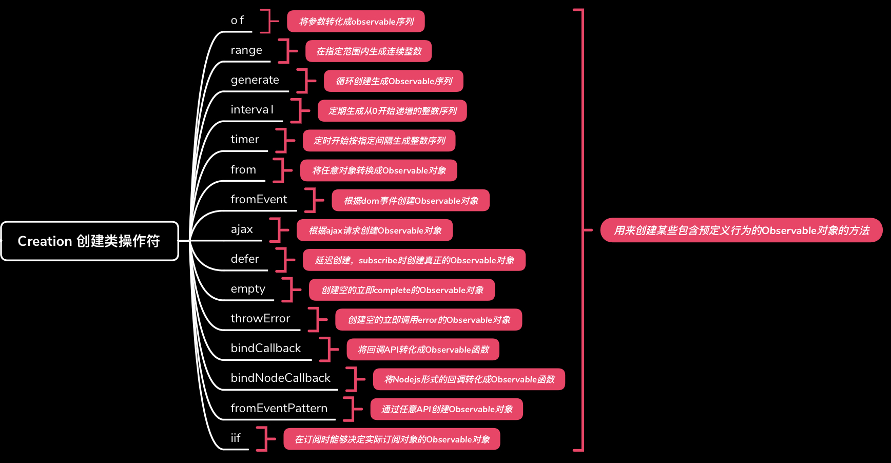

# Rxjs Creation Operators - 创建类操作符
Rxjs中提供了很多非常实用的操作符，所有的操作符都是一个个function，根据其使用目的或者功能的不同，可以将其分为两类：Creation Operators 和 Pipeable Operators。  
**Creation Operators** - 根据字面意思，可以简单理解通过该类操作符可以创建Observable对象的，如of,from,interval等。  
**Pipeable Operators** - 管道类操作符，与创建类操作符不同，该类操作符是纯函数，像一个管道一样，它接收一个Observable对象作为输入，经过处理后返回一个新的Observable对象，原输入对象不会发生改变。
## Creation Operators创建类操作符
下图列出了Rxjs v6版本中提供的全部的创建类操作符。接下来，分别通过一个或几个小的demo来理解每个操作符的作用及使用方法。
demo 地址

**of - 将参数转化成一个Observable序列**   
of可以接收多个参数，并依次转换成Observable序列中的元素，通过of生成的observable序列，其元素个数取决于传入参数的个数，与参数的类型无关。

1. 传入三个string类型的参数

         
        of('a', 'b', 'c').subscribe(
            v => console.log(v),
            err => console.log(err),
            () => console.log('complete')
        );
        // Result:（依次打印传入的参数）
        // a
        // b
        // c
        // complete
         

2. 传入一个string类型的参数

         
        of('abc').subscribe(
            v => console.log(v),
            err => console.log(err),
            () => console.log('complete')
        );

        // Result: (仅打印一个string类型的参数后结束：)
        // abc
        // complete
         

3. 传入一个Array类型的参数

         
        of(['a', 'b', 'c']).subscribe(
            v => console.log(v),
            err => console.log(err),
            () => console.log('complete')
        );

        // Result: (仅打印一个Array类型参数后结束：)
        // ['a', 'b', 'c']
        // complete
         

**range - 根据参数指定的范围生成一个包含正整数序列的Observable对象**  
其中第一个参数指定序列的起始值（Default：0），第二个参数指定序列元素的数量(Default: Undefined)，每次递增1
1. 默认从0开始，包含三个整数的序列

         
        range(null, 3).subscribe(
            v => console.log(v),
            err => console.log(err),
            () => console.log('complete')
        );

        // Result:
        // 0
        // 1
        // 2
        // complete
         
2. 从1开始，包含三个整数的序列

         
        range(1, 3).subscribe(
            v => console.log(v),
            err => console.log(err),
            () => console.log('complete')
        );
        // Result:
        // 1
        // 2
        // 3
        // complete
         
3. 从1开始，数量为0，则直接结束

         
        range(1).subscribe(
            v => console.log(v),
            err => console.log(err),
            () => console.log('complete')
        );
        // Result:
        // complete
         

**generate - 循环方式创建Observable对象，可定制化程度高，类似于js中的for** 
generate方法最少传入三个参数，分别是初始值，判断条件,值的递增；如要创建一个Observable对象，在循环生成序列的基础上对序列中每个值进行处理，则可传入一个纯函数作为第四个参数，为可选参数
1. 创建一个Observable对象，依次输出小于10的偶数，传入三个参数：初始值，判断条件,值的递增

         
        generate(0, x => x < 10, x => x + 2).subscribe(
            v => console.log(v),
            err => console.log(err),
            () => console.log('complete')
        );

        // Result:
        // 0
        // 2
        // 4
        // 6
        // 8
        // complete
         
2. 创建一个Observable对象，依次输出小于10的偶数的平方，传入四个参数：：初始值，判断条件,值的递增和处理函数

         
        generate(0, x => x < 10, x => x + 2, x => x * x).subscribe(
            v => console.log(v),
            err => console.log(err),
            () => console.log('complete')
        );

        // Result:
        // 0
        // 4
        // 16
        // 36
        // 64
        // complete
         

**interval:创建一个Observable对象，该对象按指定的时间间隔发出序号**
interval方法会从0开始生成一个整数序列，第一个元素在经过一个时间周期后输出，不会自动结束，通常结合pipeable类操作符一起使用，类似于js中的setInterval方法。
1. 每1000ms发出一个数据元素
         
        interval(1000).subscribe(
        v => console.log(v),
        err => console.log(err),
        () => console.log('complete')
        );

        // Result:
        // 0 （延时1000ms后输出,每次输出间隔1000ms）
        // 1
        // 2
        // ...(不会调用Complete)
         

**timer：创建一个Observable对象，该对象在Duetime之后开始输出第一个元素，并根据参数指定的时间间隔依次发出后续元素**
timer方法可以接受两个参数，第一个参数指定dueTime，第二个参数指定时间间隔。当两个参数相同时，相当于interval的作用,即开始时间和后续间隔一致。
1. 延时1000ms后输出（默认为1次）
         
        timer(1000).subscribe(
        v => console.log(v),
        err => console.log(err),
        () => console.log('complete')
        );

        // Result:
        // 0 (延时1000ms后输出)
        // complete
         

**from：基于传入的参数创建一个Observable对象**
from方法可以接收数组，类似数组的对象，Promise,可迭代的对象，Obsevable对象等
1. 传入数组

         
        from([1, 2, 3]).subscribe(
        v => console.log(v),
        err => console.log(err),
        () => console.log('complete')
        );

        // Result:
        // 1
        // 2
        // 3
        // complete
         
2. 传入一个可迭代的对象Set

         
        const iterableObj = new Set([10, 20, 30]);
        from(iterableObj).subscribe(
            v => console.log(v),
            err => console.log(err),
            () => console.log('complete')
        );
        // Result:
        // 10
        // 20
        // 30
        // complete
         
3. 传入一个Observable对象

         
        from(of(100, 200, 300)).subscribe(
            v => console.log(v),
            err => console.log(err),
            () => console.log('complete')
        );

        // Result:
        // 100
        // 200
        // 300
        // complete
         
4. 传入一个成功的Promise对象，能够自动调用Commplate方法

         
        const promiseSuccessful = new Promise((resolve, reject) => {
            setTimeout(() => resolve('Successful'));
        });
        from(promiseSuccessful).subscribe(
            v => console.log(v),
            err => console.log(err),
            () => console.log('complete')
        );

        // Result:
        // successful
        // complete
         
5. 传入一个失败的Promise对象，能够自动调用err方法打印错误

         
        const promiseError = new Promise((resolve, reject) => {
        setTimeout(() => reject('Error'));
        });
        from(promiseError).subscribe(
        v => console.log(v),
        err => console.log(`err called - ${err}`),
        () => console.log('complete')
        );

        // Result:
        // err called - Error
         

**fromEvent：根据DOM事件创建Observable对象（也可根据Node.js的event创建Observable对象）**
formEvent方法接收的第一个参数为DOM element，第二个参数为监听的事件名称
1. 监听button的点击事件

         
        const btnEle = document.getElementById('button1');
            fromEvent(btnEle, 'click').subscribe(
            v => console.log(v),
            err => console.log(err),
            () => console.log('complete')
            );

        // Result:
        // MouseEvent {isTrusted: true, screenX: 1770, screenY: 171, clientX: 90, clientY: 68, …}
         

**Empty: 创建一个空的Observable对象，并立即结束，调用Complete**

        empty().subscribe(
        v => console.log(v),
        err => console.log(err),
        () => console.log('complete')
        );

        // Results:
        // complete
         

**throwError:创建一个Observable对象，并立即调用错误处理方法**

        throwError('Error Happened').subscribe(
            v => console.log(v),
            err => console.log(err),
            () => console.log('complete')
        );

        // Result:
        // Error Happened
 

8. ajax
9. defer
10. empty
11. throwError
12. bindCallBack
13. bindNodeCallBack
14. fromEventPattern
15. iif

