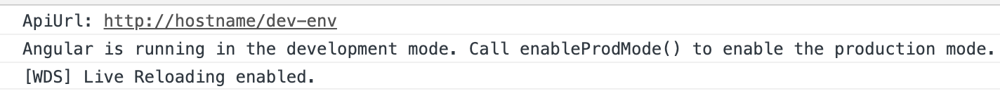
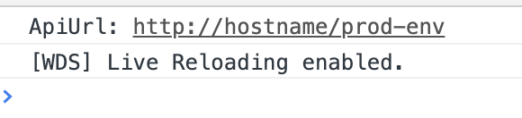

# Angular Application Environment Config
应用开发过程中，我们总会根据需要去搭建不同的开发或测试环境，Angular为我们提供了非常方便的配置项，帮助开发人员管理维护各个环境。本文主要介绍Angular环境变量的配置。
## environment.ts & environment.prod.ts
当我们通过Angular-cli初始化一个application，src目录下会自动生成environments文件夹，默认包含两个文件：environment.ts和environment.prod.ts。    
* environment.ts
生成的default文件内容如下，仅有一个production=false的flag，默认情况下，开发环境依赖于environment.ts，当然，我们可以根据自己的需要对该目录下的文件进行配置或重写。

        export const environment = {
            production: false
        };
* environment.prod.ts
同样，environment.prod.ts中也会默认生成production=true来表明该环境变量应用于production环境；当我们运行ng build [app-name] --prod或ng serve [app-name] --prod命令式，会用到environment.prod.ts。

        export const environment = {
            production: true
        };

## 环境变量的使用
1. 以不同环境，API请求地址不同为例，我们分别在环境变量中定义各自的apiUrl，分别对environment.ts和environment.prod.ts进行如下更改：
* dev

        export const environment = {
            production: false,
            apiUrl: 'http://hostname/dev-env'
        };
* prod

        export const environment = {
            production: false,
            apiUrl: 'http://hostname/prod-env'
        };

2. 将environment引入到app.component.ts中，并在其构造函数中打印运行时的apiUrl进行对比:

        // app.component.ts
        import { Component } from '@angular/core';
        import { environment } from '../environments/environment';

        @Component({
        selector: 'app-root',
        templateUrl: './app.component.html',
        styleUrls: ['./app.component.less']
        })
        export class AppComponent {
        constructor(){
            console.log('ApiUrl: '+ environment.apiUrl); // 打印apiUrl
        }
        title = 'rxjs-demo';
        }

3. 通过ng serve启动应用，控制台打印如下内容：

ApiUrl获取到的是environments/environment.ts中的内容，且输出信息：Angular is running in the development mode. Call enableProdMode() to enable the production mode.

4. 通过ng serve --prod启动应用，控制台打印如下内容：

此时，ApiUrl获取到的是environments/environment.prod.ts中的内容

综上，可以发现，虽然在app.component.ts中引入的是environments/environment.ts文件，但通过ng serve --prod运行时我们确实能够拿到我们需要的prod中的环境变量。这是因为在angular-cli的配置文件中，已经写好了默认的文件替换规则，我们运行ng serve --prod运行时，environments/environment.ts的内容被environments/environment.prod.ts替换了。

## fileReplacements configuration

根目录下找到angular.json文件，依次找到project下对应的architect-build-configurations的内容，默认已经指定了production模式下的文件替换规则。

        "configurations": {
            "production": {
                "fileReplacements": [
                    {
                        "replace": "src/environments/environment.ts",
                        "with": "src/environments/environment.prod.ts"
                    }
                ],
                //省略一些无关配置.......
            }
        }
当通过ng build --prod或者ng build --configuration=production命令进行打包时（ng serve同样会首先运行ng build），src/environments/environment.ts会被src/environments/environment.prod.ts替换掉，这也就是为什么我们能够如期取得prod的环境变量了。
了解清楚规则后，我们尝试新建一个环境变量并使用它。

## 配置一个QA的环境变量

首先，在src/environments目录下新建environment.qa.ts文件，并输入以下内容：

        export const environment = {
            production: true,
            apiUrl: 'http://hostname/qa-env'
        };
然后，对应修改angular.json文件，新建qa模式下的文件替换规则，注意此处fileReplacements对应一个数组，可以根据需要配置多组文件替换规则：

        "configurations": {
            "production": {
              ......
            },
            "qa": {
              "fileReplacements": [
                {
                  "replace": "src/environments/environment.ts",
                  "with": "src/environments/environment.qa.ts"
                }
              ],
            //省略一些无关配置.......
            }
        }

此时我们运行ng build --configuration=qa，src/environments/environment.ts就会被src/environments/environment.qa.ts替换掉。要想通过启动项目验证效果，还需要对architect-serve-configurations中添加qa环境的配置信息：

        "configurations": {
            "production": {
              "browserTarget": "rxjs-demo:build:production"
            },
            "qa": {
              "browserTarget": "rxjs-demo:build:qa"
            }
          }
现在通过ng serve --configuration=qa，验证控制台中的信息：

